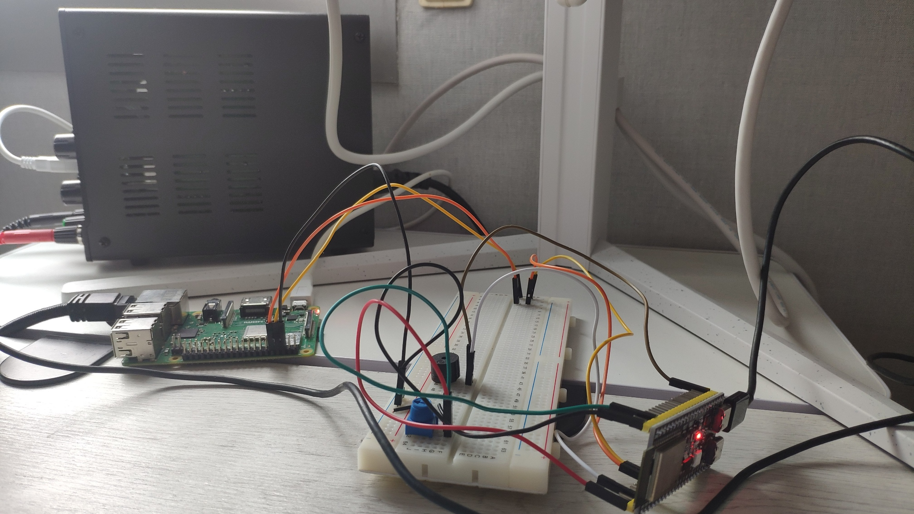

# fase3-uart-protocolo

Protocolo de comunicación serie fiable entre una ESP32-S3 (emisor) y una
Raspberry Pi (receptor) sobre UART. Implementa framing, integridad por CRC16,
confirmación por ACK, retransmisión por timeout y detección de duplicados por
número de secuencia: los mismos mecanismos que, en grande, usa TCP.

Tercer hito de la ruta. La Fase 1 leía un sensor; la Fase 2 construía un sistema
reactivo; esta saca los datos de la placa hacia otra máquina de forma fiable.

## El problema que resuelve

Un `printf` por el puerto serie no es comunicación fiable: si un byte se corrompe
o un mensaje se pierde, nadie se entera. Este proyecto añade, capa por capa, las
garantías que faltan:

| Problema | Mecanismo |
|----------|-----------|
| ¿Dónde empieza/acaba un mensaje? | Framing con bytes SOF/EOF |
| ¿Llegó corrupto? | CRC16 (CRC-16/CCITT-FALSE) |
| ¿Llegó? | ACK del receptor |
| Se perdió | Timeout + retransmisión |
| Llegó dos veces (ACK perdido) | Número de secuencia → descarte de duplicados |

## Formato de trama

```
Datos: [SOF][SEQ][LEN][PAYLOAD...][CRC16_hi][CRC16_lo][EOF]
       0x7E                                            0x7F

ACK:   [ACK_SOF][SEQ][ACK_EOF]
       0xA5           0x5A
```

El CRC16 protege `SEQ + LEN + PAYLOAD`. El receptor lo recalcula y, si no
coincide, no envía ACK: el emisor hará timeout y reintentará.

## Arquitectura

```
   ESP32-S3 (emisor)                 Raspberry Pi (receptor)
   ┌────────────────┐                ┌─────────────────────┐
   │ build_frame()  │                │ parser FSM (7 estados)│
   │ wait_for_ack() │  ── UART ──>   │ verifica CRC          │
   │ retransmisión  │  <── ACK ──    │ send_ack()            │
   │ seq + timeout  │                │ detecta duplicados    │
   └────────────────┘                └─────────────────────┘
        ESP-IDF / C                    C de Linux (termios)
```

## Cableado

3.3V en ambos lados → conexión directa, sin convertidor de niveles.

```
   ESP32-S3                  Raspberry Pi 3B+
   GPIO17 (TX) ───────────► GPIO15 / RXD0 (pin 10)
   GPIO18 (RX) ◄─────────── GPIO14 / TXD0 (pin 8)
   GND        ───────────── GND           (pin 6)
```

## Puesta en marcha

### Raspberry Pi (una sola vez)

Liberar el UART: desactivar la consola serie (`raspi-config` → Interface →
Serial → login shell *No*, hardware *Yes*) y liberar el PL011 del Bluetooth
añadiendo `dtoverlay=disable-bt` a `/boot/firmware/config.txt`. Tras reiniciar,
`/dev/serial0` debe apuntar a `ttyAMA0`.

### Compilar y ejecutar

Emisor (ESP32):
```bash
cd esp32-emisor
idf.py set-target esp32s3
idf.py -p /dev/ttyACM0 flash monitor
```

Receptor (Pi):
```bash
cd pi-receptor
make
./rx        # modo normal
./rx 4      # inyecta fallos: descarta 1 de cada 4 ACKs
```

## Demostración de recuperación ante fallos

Ejecutando el receptor con `./rx 4`, se observa el ciclo completo de recuperación
correlacionado entre las dos máquinas:

```
Pi:     [OK]  seq=16 'lectura 16' -> ACK DESCARTADO
ESP32:  Reintento 1 seq=16
ESP32:  ACK seq=16 OK
Pi:     [DUP] seq=16 -> reenvio ACK
```

El dato no se pierde ni se procesa dos veces: el contador de lecturas únicas (`ok`)
y el de duplicados absorbidos (`dup`) lo confirman.

## Documentación

- [`docs/protocolo.md`](docs/protocolo.md) — diseño del protocolo, el CRC, y los
  compromisos de diseño (timeout vs. latencia).
- [`docs/requisitos.md`](docs/requisitos.md) — requisitos con trazabilidad.

## Construcción incremental

- **A** — comunicación básica unidireccional (texto plano).
- **B** — framing + CRC16 (integridad).
- **C1** — número de secuencia + ACK + retransmisión por timeout.
- **C2** — inyección de fallos (descarte de ACKs) y detección de duplicados.

## Montaje real



A la izquierda la Raspberry Pi, a la derecha la ESP32-S3, unidas por los cables
UART (TX/RX cruzados + GND). En la protoboard, el potenciómetro y el buzzer de la
Fase 2; la fuente de alimentación al fondo.
